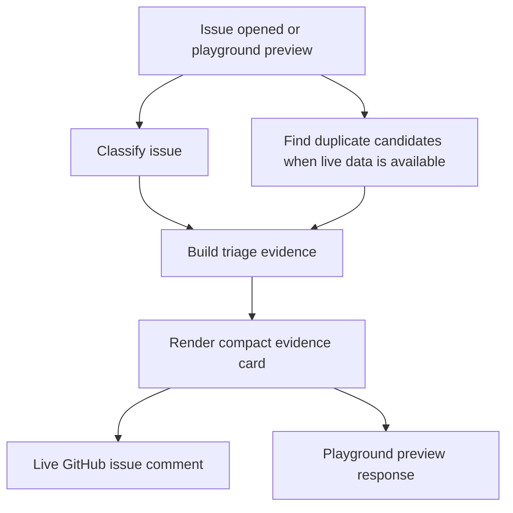

# Triage Evidence Card Implementation Plan

## Summary

Add a compact Triage Evidence Card to RepoKeeper's issue triage output and playground previews. The plan keeps the feature inside the existing GitHub issue workflow, improves duplicate presentation with a small candidate cluster, and avoids heavier surfaces such as dashboards or learning loops.

---

## Problem Frame

RepoKeeper's strategy prioritizes trustworthy triage as the first wedge for helping maintainers. The current triage path can classify issues, find duplicate candidates, apply labels, and post comments, but maintainers do not get a structured explanation of why a label or duplicate call was made.

The requirements ask for evidence that is visible where maintainers already work, plus playground parity so maintainers can preview the output before trusting it on live issues. Duplicate handling should become more transparent without becoming more aggressive: candidate issues are shown, but the new issue remains open by default.

---

## Requirements Traceability

- R1, R2: Compact evidence card with classification, label reason, and uncertainty.
- R3, R4, R5: Duplicate cluster presentation, candidate framing, and open-by-default behavior.
- R6: Continue using GitHub issue comments.
- R7: Playground previews the same evidence-card style.
- R8, R9: Preserve backward compatibility and lightweight setup.

Origin: `docs/brainstorms/2026-05-06-triage-evidence-card-requirements.md`

---

## Key Technical Decisions

- **Use a small triage result model shared by comments and playground.** The card should be composed from structured triage data so live issue comments and playground previews do not drift.
- **Start with explainable signals from current classifiers and duplicate scoring.** The first version should derive useful evidence from existing category, needs-info, and duplicate candidate data instead of introducing a new model dependency.
- **Limit duplicate clusters.** Show a small number of strongest candidates and preserve score ordering so the comment stays compact.
- **Keep duplicate issues open.** Existing tests already assert this behavior, and the requirements make it a core trust decision.
- **Keep the playground lightweight.** Playground issue previews can use sample or parsed issue input and optional mock duplicate candidates rather than requiring live GitHub access.

---

## High-Level Technical Design

> This illustrates the intended approach and is directional guidance for review, not implementation specification.

---

## Implementation Units

- U1. **Define triage evidence model and renderer**

**Goal:** Create the shared representation and markdown renderer for the compact evidence card.

**Requirements:** R1, R2, R3, R4

**Dependencies:** None

**Files:**
- Create: `src/triage/evidence.ts`
- Test: `tests/triage-evidence.test.ts`

**Approach:**
- Define a small evidence structure that can represent classification, label, reason text, uncertainty, and duplicate candidates.
- Render markdown that is compact enough for issue comments and plain enough for playground preview text.
- Keep wording candidate-based for duplicates so uncertainty is visible.

**Patterns to follow:**
- `src/utils/attribution.ts` for a small pure formatting helper.
- `tests/attribution.test.ts` for simple renderer unit coverage.

**Test scenarios:**
- Happy path: bug classification plus reason renders a compact card containing the label and reason.
- Happy path: duplicate candidates render as possible related issues in descending score order.
- Edge case: no evidence reason still renders a usable card without empty headings.
- Edge case: low or uncertain evidence uses non-final wording.

**Verification:**
- The renderer has deterministic unit tests and no GitHub or AI dependency.

---

- U2. **Attach evidence to live issue triage**

**Goal:** Update issue triage so comments include the evidence card and duplicate comments show a cluster instead of only one candidate.

**Requirements:** R1, R2, R3, R4, R5, R6, R8

**Dependencies:** U1

**Files:**
- Modify: `src/triage/responder.ts`
- Modify: `src/triage/duplicate.ts`
- Test: `tests/responder.test.ts`
- Test: `tests/duplicate.test.ts`

**Approach:**
- Keep the existing duplicate detection flow and open-by-default behavior.
- Return or preserve enough duplicate candidate data for the responder to render a small cluster.
- Append or prepend the evidence card to existing issue comments in a way that keeps attribution behavior unchanged.
- Use current classification outcomes, needs-info behavior, and duplicate scores as initial evidence signals.

**Execution note:** Characterization-first. Preserve existing responder expectations before changing comment shape.

**Patterns to follow:**
- Existing `handleIssueOpened` duplicate branch in `src/triage/responder.ts`.
- Existing duplicate sorting in `src/triage/duplicate.ts`.
- Existing attribution tests in `tests/responder.test.ts`.

**Test scenarios:**
- Happy path: detailed bug issue comment includes evidence card and bug label.
- Happy path: duplicate issue comment includes more than one candidate when multiple candidates pass threshold.
- Edge case: duplicate comment still omits attribution if current behavior is intentionally preserved.
- Edge case: vague issue evidence identifies needs-more-info without claiming high certainty.
- Integration: duplicate candidate issues remain open and receive `possible-duplicate`.

**Verification:**
- Responder tests prove card content, duplicate cluster behavior, and open-by-default behavior.

---

- U3. **Add playground issue evidence preview**

**Goal:** Make playground issue previews return the same evidence-card style used in live issue comments.

**Requirements:** R1, R7, R9

**Dependencies:** U1

**Files:**
- Modify: `src/playground.ts`
- Test: `tests/playground.test.ts`

**Approach:**
- For issue preview mode, route the preview through the evidence renderer instead of returning a disconnected free-form triage response.
- Keep PR summary preview behavior unchanged.
- Avoid live GitHub access in playground. If duplicate examples are needed for preview, use parsed or sample candidates from input only when explicit enough, otherwise show classification evidence only.

**Patterns to follow:**
- Existing `/playground/preview` request validation and rate limiting in `src/playground.ts`.
- Existing playground route tests in `tests/playground.test.ts`.

**Test scenarios:**
- Happy path: issue preview returns evidence-card text for an issue input.
- Happy path: PR summary preview still returns the existing AI summary result.
- Edge case: invalid type, empty input, long input, and provider failure behavior remain unchanged.
- Integration: issue preview uses the same renderer exercised by `tests/triage-evidence.test.ts`.

**Verification:**
- Playground tests prove route parity without adding GitHub network requirements.

---

- U4. **Document evidence card behavior and configuration expectations**

**Goal:** Update user-facing docs so maintainers understand what the evidence card does and what it deliberately does not do.

**Requirements:** R4, R5, R6, R7, R9

**Dependencies:** U2, U3

**Files:**
- Modify: `README.md`
- Modify: `repokeeper.config.example.ts` only if implementation adds optional settings
- Test: none, documentation-only unless config changes require coverage

**Approach:**
- Describe the compact evidence card under issue triage and playground sections.
- Make open-by-default duplicate handling explicit.
- If no new config is added, avoid expanding setup instructions.

**Patterns to follow:**
- Existing README sections for Issue Triage and Interactive Playground.
- Existing configuration table style in `README.md`.

**Test scenarios:**
- Test expectation: none for documentation-only edits.
- If optional config is added, add config coverage in `tests/config.test.ts`.

**Verification:**
- Documentation matches the implemented behavior and does not promise auto-closing or dashboards.

---

## System-Wide Impact

- **Interaction graph:** `issues.opened` triage comments and `/playground/preview` issue previews share evidence rendering. PR workflows should remain unchanged.
- **Error propagation:** Evidence rendering should be pure and should not add new failure paths to webhook handling. AI or GitHub failures should keep current error behavior.
- **State lifecycle risks:** No new persistent state is required for v1.
- **API surface parity:** Live issue comments and playground issue previews should use the same output style.
- **Integration coverage:** Responder and playground tests should cover the cross-surface behavior.
- **Unchanged invariants:** Duplicate candidates do not close issues by default. Existing labels and attribution behavior remain compatible unless explicitly changed by implementation.

---

## Risks & Dependencies

| Risk | Mitigation |
|------|------------|
| Evidence comments become too verbose | Keep renderer compact and test for focused content. |
| Duplicate clusters look too authoritative | Use candidate wording and preserve open-by-default behavior. |
| Playground diverges from live triage | Share the renderer and add tests for issue preview output. |
| Evidence reason overstates model certainty | Start with conservative wording and current deterministic signals. |
| Config surface grows too early | Avoid new settings unless implementation proves they are necessary. |

---

## Documentation / Operational Notes

- Update `README.md` to explain the evidence card in maintainer-facing language.
- Keep setup unchanged unless optional evidence settings are introduced.
- No migration or new infrastructure should be required.

---

## Scope Boundaries

### In Scope

- Compact evidence card in live issue comments.
- Compact evidence card in playground issue previews.
- Duplicate cluster presentation for possible duplicates.
- Open-by-default duplicate handling.
- Tests for renderer, responder, duplicate cluster, and playground behavior.

### Deferred to Follow-Up Work

- Maintainer correction loop.
- Repo-specific custom label mapping.
- Triage quality benchmark.
- Confidence-gated actions beyond conservative wording.

### Out of Scope

- Auto-closing duplicate issues by default.
- Triage analytics dashboard.
- Replacing duplicate detection with embeddings.
- New hosted service, database, or dashboard requirement.

---

## Sources & References

- Origin document: `docs/brainstorms/2026-05-06-triage-evidence-card-requirements.md`
- Product strategy: `STRATEGY.md`
- Ideation source: `docs/ideation/2026-05-06-open-ideation.md`
- Existing triage: `src/triage/classifier.ts`, `src/triage/duplicate.ts`, `src/triage/responder.ts`
- Existing playground: `src/playground.ts`
- Existing tests: `tests/classifier.test.ts`, `tests/duplicate.test.ts`, `tests/responder.test.ts`, `tests/playground.test.ts`
- External reference: CodeRabbit Issue Enrichment, `https://docs.coderabbit.ai/issues/enrichment`
- External reference: GitHub label docs, `https://docs.github.com/en/issues/using-labels-and-milestones-to-track-work/managing-labels`
